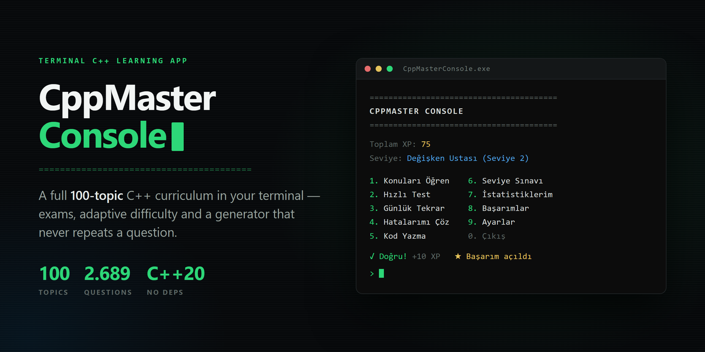

# CppMaster Console

[](https://github.com/Layellie/cppmaster-console/actions/workflows/ci.yml)
[](LICENSE)
[](https://en.cppreference.com/w/cpp/20)

**Language / Dil: [English](#english) · [Türkçe](#türkçe)**

> **Note:** the application's own interface is **Turkish only**. This README
> is available in both languages, but the app itself is not localised.
>
> **Not:** uygulamanın arayüzü **yalnızca Türkçe**'dir. Bu README iki dilde
> yazılmıştır, ancak uygulamanın kendisi çevrilmemiştir.

---

<a id="english"></a>

# English

A terminal-based app for learning C++, with a **Turkish-language
interface**. It covers a full 100-topic curriculum, 2,689 hand-written
questions, hint / topic-lock / adaptive-difficulty systems, code-writing
exercises, per-section exams, a general final exam, and a dynamic question
generator built from 17 generators that never asks the same question twice.

## Quick install (Windows)

You do not need a compiler or CMake — a single command downloads a
prebuilt, standalone `.exe` and runs it:

```powershell
irm https://raw.githubusercontent.com/Layellie/cppmaster-console/master/install.ps1 | iex
```

This downloads the build produced from the latest `master` commit into
`%LOCALAPPDATA%\CppMasterConsole` and launches it; your progress is kept in
that same folder across runs. The executable links the MSVC runtime
statically, so it runs even without the Visual C++ Redistributable
installed — its only dependency is `KERNEL32.dll`.

If you would rather not pipe a script into your shell, read
[`install.ps1`](install.ps1) first (it is short), or build from source with
the instructions below. See [SECURITY.md](SECURITY.md) for the full trust
discussion.

## What it looks like

```
========================================
CPPMASTER CONSOLE
========================================

Toplam XP: 75
Seviye: Değişken Ustası (Seviye 2)

1. Konuları Öğren          6. Seviye Sınavı
2. Hızlı Test              7. İstatistiklerim
3. Günlük Tekrar           8. Başarımlar
4. Hatalarımı Çöz          9. Ayarlar
5. Kod Yazma Alıştırmaları 10. İlerlemeyi Sıfırla
0. Çıkış
```

A slice of a topic quiz — correct answers print green, wrong ones red, and
achievements yellow:

```
Konu testi başlıyor (8 soru).

cout, kullanıcıdan klavyeden veri okumak için kullanılır.
1. Doğru
2. Yanlış
Cevabın: 2
Doğru! (+5 XP)

Yeni başarım kazandın: İlk Adım
İlk sorunu çözdün.
```

While answering, the commands `ipucu` (hint), `konu` (lesson), `ornek`
(example), `gec` (skip) and `cikis` (exit) are available; each hint level
costs 25% of the XP the question would award.

## Features

- **Topics:** 100 topics across 10 sections, each with full lesson content
  (explanation, syntax, example code, line-by-line commentary, common
  mistakes).
- **Questions:** 2,689 hand-written questions covering all 11 question
  types, plus questions generated in real time in "Hızlı Test" (Quick Test)
  mode that never repeat — 17 generators driven by a 4-stage escalation
  algorithm (Normal → Expanded Parameters → Structural Variation → Cross
  Topic).
- **Topic locking:** topics are genuinely locked and unlock in order — you
  cannot reach a topic before completing the previous one, and locked
  topics are not listed at all. The experience level you pick on first
  launch sets the starting range (beginner: topic 1 only; intermediate:
  1-20; experienced: 1-40). The whole system can be switched off in
  Settings.
- **Exams:** a 20-question exam per section plus a 100-question general
  final exam (70% to pass, gated on how much of the material you have
  completed).
- **Hint system:** the in-quiz `ipucu`/`konu`/`ornek`/`gec`/`cikis`
  commands; each hint level reduces the XP awarded.
- **Adaptive difficulty:** consecutive correct answers jump to harder
  questions; consecutive wrong ones trigger automatic extra help.
- **Code-writing exercises:** 25 hand-written exercises across three tiers
  (Beginner / Intermediate / Advanced); completed ones are marked in the
  list.
- **XP / levels / achievements:** a 10-level XP system, unlockable
  achievements, mistake-review and daily-review flows.
- **Personalisation:** coloured output, an audible alert, and the Quick Test
  question count and the topic-quiz question count — all configurable in
  Settings.
- **Persistence:** progress, mistake records, achievements, generated-question
  history and settings are stored in a `data/` folder (not tracked by git).

## Building from source

### Requirements

- CMake ≥ 3.20
- A C++20 compiler — MSVC 2022+, GCC 11+ or Clang 14+ (all three are
  verified in CI, see [Platform support](#platform-support))
- **No third-party dependencies** — everything, including the unit-test
  framework, is written against the standard library

### Build

With CMake presets (recommended):
```bash
cmake --preset default         # configure
cmake --build --preset default # build
ctest --preset default         # test
```

Or the classic way:
```bash
cmake -B build
cmake --build build
```

For a standalone, distributable Release build:
```bash
cmake --preset release && cmake --build --preset release
```
On MSVC the runtime is linked statically (`CMAKE_MSVC_RUNTIME_LIBRARY` in
`CMakeLists.txt`), so the resulting `.exe` runs on a machine without the
Visual C++ Redistributable.

### Running

On multi-config CMake generators such as Windows/MSVC:
```bash
./build/Debug/CppMasterConsole.exe
```
On single-config generators (Makefiles, Ninja):
```bash
./build/CppMasterConsole
```

### Running the tests

```bash
ctest --test-dir build --output-on-failure
```
or by running the test binary directly:
```bash
./build/Debug/CppMasterConsoleTests.exe
```

The test suite has no dependencies beyond the standard library; a small
self-registering framework (`TEST_CASE`) lives in `tests/TestRunner.h`.
There is also a separate `CppMasterConsoleStressTests` target that puts the
generation system through 10,000+ iterations. It is deliberately excluded
from `ctest` because it takes ~10-15 seconds, which would slow the everyday
test loop; run it manually:
```bash
./build/Debug/CppMasterConsoleStressTests.exe
```

### Automated builds and releases

`.github/workflows/release.yml` builds in Release mode on every push to
`master`, runs the tests and the stress suite, and uploads the standalone
`.exe` to the repository's "latest" GitHub Release — that is the build
`install.ps1` downloads.

## Project layout

```
src/                Application source (CppMasterConsoleLib static library + main.cpp)
src/generators/     Dynamic question generators (17, each in its own .h/.cpp)
tests/              Unit tests (CppMasterConsoleTests target)
tests/Generators/   A separate test file per generator
tests/StressTests/  10,000+ iteration generation stress tests (separate target)
data/               Per-user progress/statistics/settings files (not tracked)
docs/superpowers/   Development process: design docs (specs/), plans (plans/), roadmap.md
.github/workflows/  CI: build, test, static analysis and GitHub Release automation
install.ps1         One-line install/launch script
```

## Architecture notes

The technically most interesting part is the **dynamic question generation
system**, whose goal is unlimited practice without ever asking the same
question twice:

- Each generator (`src/generators/`) owns a single topic and implements the
  `IQuestionGenerator` interface.
- Every generated question carries two signatures: **exact** (all drawn
  parameters, including the cosmetic variable name) and **semantic**
  (excluding cosmetic differences). Both are hashed with FNV-1a and stored
  in `QuestionHistory`, so "the same question with a different variable
  name" is not asked again.
- `QuestionGenerationEngine` implements a 4-stage escalation: **Normal →
  Expanded Parameters → Structural Variation**, and if all of those are
  exhausted, a **Cross Topic** fallback (the other generators, ordered by
  success rate). Each stage gets a budget of 20 attempts.
- `GeneratorScoring` tracks each generator's success rate, and
  `GeneratedQuestionValidator` independently verifies that a generated
  question is structurally valid.

This system is verified by a 10,000-iteration stress test: zero repeats,
zero invalid questions, 100% generation success (`tests/StressTests/`).

Other design decisions:

- Everything in `src/` is **dependency-free and pure**: the business logic
  (`QuizEngine`, `LevelSystem`, `TopicLock`, `AdaptiveDifficulty`) is
  separate from console I/O, which is what makes it fully unit-testable.
- Persistent data lives in plain text files; every loader detects a
  corrupted file, backs it up and falls back to defaults
  (`*_corrupted_backup.txt`).
- Lesson and question content is compiled in (`LessonContentSectionN.cpp`,
  `QuestionsSectionN.cpp`) — a deliberate choice so the app ships as a
  single file with no external data.

## About test coverage

Every pure-logic and persistence class under `src/` is covered by unit
tests. `Application` and `ConsoleUI` (the interactive, keyboard-driven
parts) are deliberately outside unit-test coverage — they are verified
end-to-end with hand-built input scenarios during development, visible in
each phase's plan under `docs/superpowers/plans/`.

## Platform support

Every push and pull request runs four jobs in CI:

| Job | Compiler / tool | Status |
|---|---|---|
| Windows | MSVC (`/W4 /permissive-`) | ✅ build + tests + stress tests, **0 warnings** |
| Linux | GCC (`-Wall -Wextra -Wpedantic -Wconversion -Wshadow`) | ✅ build + tests + stress tests, **0 warnings** |
| Linux | Clang (same flags) | ✅ build + tests + stress tests, **0 warnings** |
| Static analysis | clang-tidy | ✅ blocking (`-warnings-as-errors='*'`) |

The only platform-specific behaviour is isolated behind `#ifdef _WIN32` in
`src/ConsoleUI.cpp`: the screen-clear command, the UTF-8 code page, and
`ENABLE_VIRTUAL_TERMINAL_PROCESSING` for ANSI colour support. If colour
cannot be enabled, output silently falls back to plain text rather than
printing broken escape sequences.

macOS is not tested separately, but it exercises the same code paths as
Linux/Clang and is expected to work.

## Contributing

Contributions are welcome — code, lesson content, or question corrections.
See [CONTRIBUTING.md](CONTRIBUTING.md) for details, and
[SECURITY.md](SECURITY.md) for security-related matters.

## Changelog

See [CHANGELOG.md](CHANGELOG.md) for changes between versions.

## License

[MIT](LICENSE) — Copyright (c) 2026 Samet Kaşmer.

<div align="right"><a href="#cppmaster-console">⬆ Back to top</a></div>

---

<a id="türkçe"></a>
<a id="turkce"></a>

# Türkçe

C++ öğrenmek için terminal tabanlı, Türkçe bir alıştırma ve sınav
uygulaması. 100 konuluk tam bir müfredat, 2.689 elle yazılmış soru,
ipucu / konu kilidi / adaptif zorluk sistemleri, kod yazma alıştırmaları,
bölüm sınavları, genel bir final sınavı ve 17 üreticiden oluşan, aynı
soruyu iki kez sormayan dinamik bir soru üretim sistemi içerir.

## Hızlı kurulum (Windows)

Derleyici veya CMake kurmana gerek yok — tek satırlık komutla önceden
derlenmiş, bağımsız bir `.exe` indirilip çalıştırılır:

```powershell
irm https://raw.githubusercontent.com/Layellie/cppmaster-console/master/install.ps1 | iex
```

Bu, en son `master` commit'inden otomatik derlenen sürümü
`%LOCALAPPDATA%\CppMasterConsole` altına indirir ve başlatır; ilerlemen
sonraki çalıştırmalarda aynı klasörde saklanır. Derlenen `.exe`, MSVC
çalışma zamanına statik olarak bağlıdır — Visual C++ Redistributable
kurulu olmasa bile çalışır, tek bağımlılığı `KERNEL32.dll`'dir.

Bir script'i doğrudan kabuğuna aktarmak istemiyorsan önce
[`install.ps1`](install.ps1) dosyasını oku (kısadır) ya da aşağıdaki
adımlarla kaynaktan derle. Güven konusunun tamamı için
[SECURITY.md](SECURITY.md).

## Nasıl görünüyor?

```
========================================
CPPMASTER CONSOLE
========================================

Toplam XP: 75
Seviye: Değişken Ustası (Seviye 2)

1. Konuları Öğren          6. Seviye Sınavı
2. Hızlı Test              7. İstatistiklerim
3. Günlük Tekrar           8. Başarımlar
4. Hatalarımı Çöz          9. Ayarlar
5. Kod Yazma Alıştırmaları 10. İlerlemeyi Sıfırla
0. Çıkış
```

Bir konu testinden kesit — doğru cevap yeşil, yanlış kırmızı gösterilir,
başarımlar sarı:

```
Konu testi başlıyor (8 soru).

cout, kullanıcıdan klavyeden veri okumak için kullanılır.
1. Doğru
2. Yanlış
Cevabın: 2
Doğru! (+5 XP)

Yeni başarım kazandın: İlk Adım
İlk sorunu çözdün.
```

Soru sırasında `ipucu`, `konu`, `ornek`, `gec` ve `cikis` komutları
kullanılabilir; her ipucu kazanılacak XP'yi %25 azaltır.

## Kapsam

- **Konular:** 100 konu, 10 bölüm, hepsinde tam ders içeriği (açıklama,
  sözdizimi, örnek kod, satır satır açıklama, yaygın hatalar).
- **Sorular:** 2.689 elle yazılmış soru (11 soru tipinin tamamı
  kullanılıyor), artı "Hızlı Test" modunda gerçek zamanlı üretilen ve
  hiç tekrar etmeyen sorular (17 üretici, 4 aşamalı üretim algoritması:
  Normal → Genişletilmiş Parametreler → Yapısal Varyasyon → Çapraz Konu).
- **Konu kilidi:** Konular gerçekten kilitli ve sırayla açılıyor — bir
  konuyu tamamlamadan bir sonrakine erişilemez, kilitli konular listede
  hiç görünmez. İlk açılışta seçtiğin deneyim seviyesi başlangıç
  aralığını belirler (yeni başlayan: yalnızca 1. konu; orta seviye:
  1-20; deneyimli: 1-40). Kilit sistemi Ayarlar'dan tamamen
  kapatılabilir.
- **Sınavlar:** Her bölüm için 20 soruluk bir sınav, artı 100 soruluk genel
  final sınavı (%70 geçme notu, konu tamamlama oranına göre kilitli).
- **İpucu sistemi:** Test sırasında `ipucu`/`konu`/`ornek`/`gec`/`cikis`
  komutları; her ipucu seviyesi kazanılan XP'yi azaltır.
- **Adaptif zorluk:** Art arda doğru cevaplar daha zor sorulara atlar; art
  arda yanlışlar otomatik ekstra yardım gösterir.
- **Kod Yazma Alıştırmaları:** 3 seviyede (Başlangıç/Orta/İleri) 25 elle
  yazılmış kod alıştırması; tamamladıkların listede işaretlenir.
- **XP/Seviye/Başarımlar:** 10 seviyelik XP sistemi, açılabilir başarımlar,
  yanlış-tekrar ve günlük tekrar akışları.
- **Kişiselleştirme:** Renkli çıktı (doğru/yanlış/başarım geri bildirimi),
  sesli uyarı, Hızlı Test ve konu testi soru sayıları — hepsi Ayarlar'dan
  değiştirilebilir.
- **Kalıcı veri:** İlerleme, yanlış kayıtları, başarımlar, üretilen soru
  geçmişi ve ayarlar `data/` klasöründe saklanır (git'e dahil değil).

## Geliştirici olarak derleme

### Gereksinimler

- CMake ≥ 3.20
- C++20 destekleyen bir derleyici — MSVC 2022+, GCC 11+ veya Clang 14+
  (üçü de CI'da doğrulanıyor, bkz. [Platform desteği](#platform-desteği))
- Üçüncü parti bağımlılık **yok**; test çatısı dahil her şey standart
  kütüphaneyle yazıldı

### Derleme

CMake preset'leriyle (önerilen):
```bash
cmake --preset default         # yapılandır
cmake --build --preset default # derle
ctest --preset default         # test et
```

Ya da klasik yöntemle:
```bash
cmake -B build
cmake --build build
```

Bağımsız, dağıtılabilir bir Release derlemesi için:
```bash
cmake --preset release && cmake --build --preset release
```
MSVC'de çalışma zamanı statik bağlanır (`CMakeLists.txt` içindeki
`CMAKE_MSVC_RUNTIME_LIBRARY`), böylece çıkan `.exe` Visual C++
Redistributable kurulu olmayan bir makinede de çalışır.

### Çalıştırma

Windows/MSVC gibi çok yapılandırmalı CMake generator'lerinde:
```bash
./build/Debug/CppMasterConsole.exe
```
Tek yapılandırmalı CMake generator'lerinde (Makefiles, Ninja):
```bash
./build/CppMasterConsole
```

### Testleri çalıştırma

```bash
ctest --test-dir build --output-on-failure
```
veya test binary'sini doğrudan çalıştırarak:
```bash
./build/Debug/CppMasterConsoleTests.exe
```

Test paketi standart kütüphane dışında hiçbir bağımlılık kullanmaz; kendi
kendini kaydeden (`TEST_CASE`), basit bir test çatısı `tests/TestRunner.h`
içinde tanımlıdır. Ayrıca, dinamik soru üretim sistemini 10.000+
iterasyonda stres testinden geçiren ayrı bir `CppMasterConsoleStressTests`
hedefi var (bilinçli olarak `ctest`'e dahil değil, çünkü ~10-15 saniye
sürüyor — hızlı test döngüsünü yavaşlatmaması için elle çalıştırılır):
```bash
./build/Debug/CppMasterConsoleStressTests.exe
```

### Otomatik derleme ve dağıtım

`.github/workflows/release.yml`, `master`'a her push'ta Release modunda
derler, testleri ve stres testlerini çalıştırır, ardından bağımsız `.exe`'yi
repo'nun "latest" GitHub Release'ine yükler — `install.ps1`'in indirdiği
sürüm budur.

## Proje yapısı

```
src/                Uygulama kaynak kodu (CppMasterConsoleLib statik kütüphanesi + main.cpp)
src/generators/     Dinamik soru üreticileri (17 adet, her biri kendi .h/.cpp'sinde)
tests/              Birim testleri (CppMasterConsoleTests hedefi)
tests/Generators/   Her üretici için ayrı test dosyaları
tests/StressTests/  10.000+ iterasyonluk üretim stres testleri (ayrı hedef)
data/               Kullanıcının ilerleme/istatistik/ayar dosyaları (git'e dahil değil)
docs/superpowers/   Geliştirme süreci: tasarım dokümanları (specs/), planlar (plans/), roadmap.md
.github/workflows/  CI: derleme, test, statik analiz ve GitHub Release otomasyonu
install.ps1         Tek satırlık kurulum/başlatma script'i
```

## Mimari notlar

Projenin teknik olarak en ilginç parçası **dinamik soru üretim sistemi**.
Amaç, kullanıcıya aynı soruyu iki kez sormadan sınırsız pratik sağlamak:

- Her üretici (`src/generators/`) tek bir konudan sorumludur ve
  `IQuestionGenerator` arayüzünü uygular.
- Üretilen her soru iki imza taşır: **exact** (tüm parametreler, kozmetik
  değişken adı dahil) ve **semantic** (kozmetik farklar hariç). İkisi de
  FNV-1a ile hash'lenip `QuestionHistory`'de saklanır; böylece "aynı soru,
  farklı değişken adıyla" tekrar sorulmaz.
- `QuestionGenerationEngine` 4 aşamalı bir tırmanma uygular: **Normal →
  Genişletilmiş Parametreler → Yapısal Varyasyon**, hepsi tükenirse
  **Çapraz Konu** yedeği (başarı oranına göre sıralanmış diğer üreticiler).
  Her aşamaya 20 deneme bütçesi verilir.
- `GeneratorScoring` her üreticinin başarı oranını takip eder;
  `GeneratedQuestionValidator` üretilen sorunun yapısal geçerliliğini
  bağımsız olarak doğrular.

Bu sistem 10.000 iterasyonluk bir stres testiyle doğrulanıyor: sıfır
tekrar, sıfır geçersiz soru, %100 üretim başarısı
(`tests/StressTests/`).

Diğer tasarım kararları:

- `src/` içindeki her şey **bağımlılıksız ve saf**: iş mantığı
  (`QuizEngine`, `LevelSystem`, `TopicLock`, `AdaptiveDifficulty`) konsol
  G/Ç'sinden ayrıdır, bu yüzden tamamı birim testiyle kapsanabiliyor.
- Kalıcı veri düz metin dosyalarında tutulur; her yükleyici bozuk dosyayı
  algılayıp yedekler ve varsayılanlara döner (`*_corrupted_backup.txt`).
- Ders ve soru içeriği koda gömülüdür (`LessonContentSectionN.cpp`,
  `QuestionsSectionN.cpp`) — uygulamanın tek dosya olarak dağıtılabilmesi
  ve harici veri dosyası gerektirmemesi için bilinçli bir tercih.

## Test kapsamı hakkında

`src/` altındaki saf mantık ve dosya-kalıcılık sınıflarının tamamı birim
testleriyle kapsanır. `Application` ve `ConsoleUI` (etkileşimli, klavyeden
girdi bekleyen kısımlar) bilinçli olarak birim testi kapsamı dışında
bırakıldı — bunlar, geliştirme sürecinde elle hazırlanmış giriş
senaryolarıyla uçtan uca doğrulanmaya devam ediyor
(`docs/superpowers/plans/` içindeki her fazın planında görülebilir).

## Platform desteği

Her push ve pull request'te CI'da dört iş çalışır:

| İş | Derleyici / araç | Durum |
|---|---|---|
| Windows | MSVC (`/W4 /permissive-`) | ✅ derleme + testler + stres testleri, **0 uyarı** |
| Linux | GCC (`-Wall -Wextra -Wpedantic -Wconversion -Wshadow`) | ✅ derleme + testler + stres testleri, **0 uyarı** |
| Linux | Clang (aynı bayraklar) | ✅ derleme + testler + stres testleri, **0 uyarı** |
| Statik analiz | clang-tidy | ✅ bloklayıcı (`-warnings-as-errors='*'`) |

Platforma özgü tek davranış `src/ConsoleUI.cpp` içinde `#ifdef _WIN32` ile
izole edilmiştir: konsol temizleme komutu, UTF-8 kod sayfası ayarı ve ANSI
renk desteği için `ENABLE_VIRTUAL_TERMINAL_PROCESSING`. Renk desteği
açılamazsa çıktı sessizce renksize düşer, bozuk kaçış dizileri basılmaz.

macOS ayrıca test edilmiyor, ancak Linux/Clang ile aynı kod yollarını
kullandığından çalışması bekleniyor.

## Katkıda bulunma

Katkılar memnuniyetle karşılanır — kod, ders içeriği veya soru
düzeltmeleri. Ayrıntılar için [CONTRIBUTING.md](CONTRIBUTING.md)'ye bakın.
Güvenlikle ilgili konular için [SECURITY.md](SECURITY.md).

## Sürüm geçmişi

Sürümler arası değişiklikler için [CHANGELOG.md](CHANGELOG.md).

## Lisans

[MIT](LICENSE) — Copyright (c) 2026 Samet Kaşmer.

<div align="right"><a href="#cppmaster-console">⬆ Başa dön</a></div>
